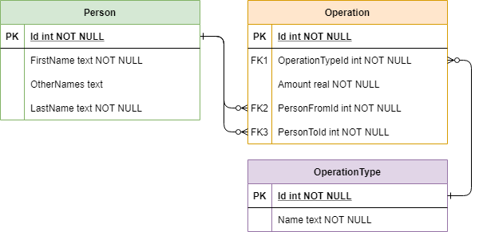

# LoanWebApp

## Introduction

LoanWebApp is a full-stack Web app which lets the user register persons and operations
(loans and repayments) between the registered persons.

Tech stack:

* Angular (version 8)

* .NET Core (3.1)

* SQLite

LoanWebApp is built using the .NET Core Angular template (`dotnet new angular -f netcoreapp3.1`).

A SQLite database file `app.db` has been included which already has 5 persons and 20 operations added to it.

The image below shows the ER diagram of the database:

Entity Framework Core is used in this project using the "code-first" approach, meaning the entity
C# classes were created first, and the database tables are generated from them. An initial database
migration is included in the `Migrations` folder.

## Building and running the project

To build the project, .NET Core 3.1 compatible SDK is required. More information here: <https://dotnet.microsoft.com/download>

Node.js is also required (either the LTS or current version). You can download it here: <https://nodejs.org/>

To run the source code, run `dotnet run` from the project root folder. It might take a while
the first time you run it, because it automatically runs `npm install` in the background to
build the front-end Angular application (if you wish, you can run it manually beforehand
from the ClientApp folder). If the application builds and runs successfully,
you should be able to access the app from the browser at <https://localhost:5001/>

To stop the application, input Ctrl+C in the console where you ran the project from.
